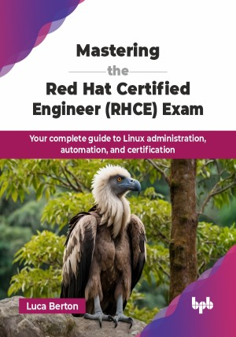

# Mastering the Red Hat Certified Engineer (RHCE) Exam

Your complete guide to Linux administration, automation, and certification.

This is the repository for
[Mastering the Red Hat Certified Engineer (RHCE) Exam](https://bpbonline.com/products/mastering-the-red-hat-certified-engineer-rhce-exam?variant=44305789976776),
published by BPB Publications.

## About the Book

"Mastering the Red Hat Certified Engineer (RHCE) Exam" is a comprehensive guide designed for IT professionals and system administrators aspiring to achieve RHCE certification. This book is an essential resource for mastering Red Hat Enterprise Linux (RHEL) skills and advancing careers in Linux administration.

This book is designed to guide you through every stage of preparing for the RHCE certification. It introduces the importance of RHCE in IT and breaks down the exam blueprint, covering both theory and practical skills. You will learn Linux basics, automate tasks using tools like bash scripting and Ansible, manage network services and SELinux security, and explore emerging technologies like containers and virtualization. The book also covers performance optimization and troubleshooting, providing strategies to tackle the exam with confidence. Practice exams simulate real-world scenarios to help you succeed and achieve your RHCE certification.

By the end, readers will be fully prepared for the RHCE exam and equipped with practical skills for Linux administration roles. This book enables aspiring engineers to excel in complex Linux environments, supporting their journey towards RHCE certification and professional growth in the dynamic IT landscape.

## What You Will Learn

• The essentials of Red Hat Enterprise Linux administration.

• Automation of tasks using Ansible and scripting tools.

• Effective management of networking and security in RHEL.

• Hands-on skills in SELinux configuration and troubleshooting.

• Practical insights into container management and deployment.

• Preparation techniques for success in the RHCE certification.
